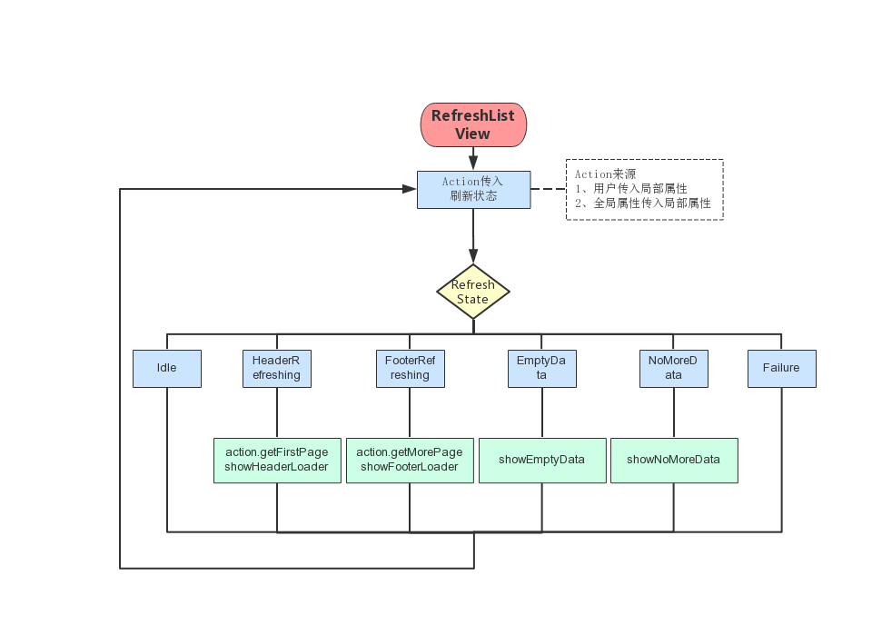

[TOC]
# rn_template 基于ReactNative前端框架设计与实现
# 1. 架构设计
## 1.1 应用框架
## 1.2 项目框架
本项目采用的框架为Redux+saga+Immutable Data

1. 介绍
2. 架构图

# 2. 状态机机制
## 2.1 Redux

1. store
2. state
3. action
4. reducer

## 2.2 Redux-saga
## 2.3 Immutable Data
# 3. 组件化开发思想
## 3.1 ReactNative 组件化开发思想
React也带来了组件化开发的思想，所谓组件，即封装起来的具有独立功能的UI部件。React推荐以组件的方式去重新思考UI构成，将UI上每一个功能相对独立的模块定义成组件，然后将小的组件通过组合或者嵌套的方式构成大的组件，最终完成整体UI的构建。
## 3.2 基本UI组件

1. RefreshListView

支持下拉刷新，上拉加载的列表

（1）实现原理

基于FlatList的下拉刷新，上拉加载的控件。采用了状态模式的设计模式。根据刷新状态更改对应的UI和行为。流程如下：



（2）接口介绍

| Prop | Type | Description | Default |
| :- | :- | :- | :- |
| refreshState | number | 列表刷新状态：<br/>1、Idle（普通状态）<br/>2、HeaderRefreshing（头部刷新）<br/>3、FooterRefreshing（底部刷新）<br/>4、NoMoreData（已加载全部数据）<br/>5、EmptyData（空数据）<br/>6、Failure（加载失败） | None |
| onHeaderRefresh | (refreshState: number) => void | 下拉刷新回调方法<br/>refreshState参数值为RefreshState.HeaderRefreshing | None |
| onFooterRefresh | (refreshState: number) => void | 上拉翻页回调方法<br/>refreshState参数值为RefreshState.FooterRefreshing | None |
| data | Array | 同FlatList中的data属性 | None |
| footerRefreshingText | ?string | 自定义底部刷新中文字 | '数据加载中…' |
| footerFailureText | ?string | 自定义底部失败文字 | '点击重新加载' |
| footerNoMoreDataText | ?string | 自定义底部已加载全部数据文字 | '已加载全部数据' |
| footerEmptyDataText | ?string | 自定义空数据文字 | '暂时没有相关数据' |
| footerRefreshingComponent | ?any | 自定义底部刷新控件 | null |
| footerFailureComponent | ?any | 自定义底部失败控件 | null |
| footerNoMoreDataComponent | ?any | 自定义底部已加载全部数据控件 | null |
| footerEmptyDataComponent | ?any | 自定义空数据控件 | null |
| renderItem | Function | 对列表中每一行（项）进行渲染 | null |

（3）使用方式 & 展示

```
<RefreshListView
    data={this.state.dataList}
    keyExtractor={this.keyExtractor}
    renderItem={this.renderCell}

    refreshState={this.state.refreshState}
    onHeaderRefresh={this.onHeaderRefresh}
    onFooterRefresh={this.onFooterRefresh}
/>
```


2. ImagePickerViewer/ZoomableImageView
图片轮播图

3. modalDropdownBar
下拉列表

4. FloatingTextInput
浮动输入框

5. multiFuncTextInput
多功能输入框

6. SpinnerLoading
动态加载框

7. SwipeableView
侧滑框

8. TableView
表格

9. Toolbar
工具栏

## 3.3 功能UI组件

1. AIServer

2. rnMap

3. WebEchartsCard

# 4. 模块化设计
## 4.1 通讯模块
## 4.2 路由模块
## 4.3 原生模块
## 4.4 UI模块
# 5. 功能展示
## 5.1 基本表单数据显示
## 5.2 基于图表数据显示
## 5.3 地图功能
## 5.4 基于websocket的实时数据获取
## 5.5 设置功能（缓存、权限、用户状态等处理）
# 6. 应用展示
## 6.1 运动热——为教练研发的教学辅导工具
## 6.2 Supnuevo——直销超市/供应商/客户网络平台
## 6.3 危险品车辆监控系统
