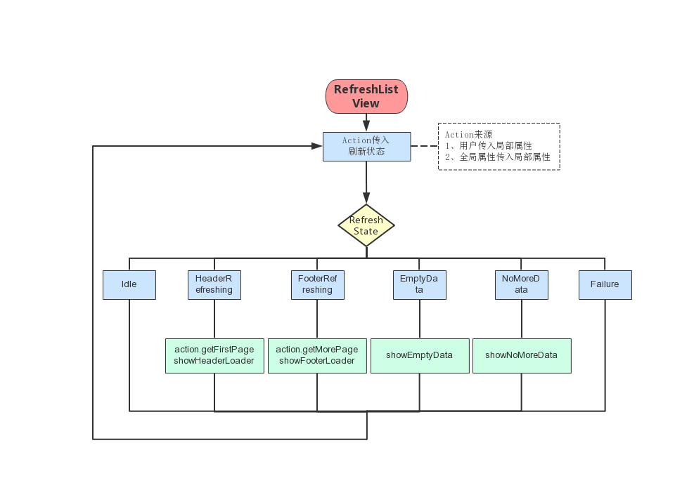

# 1.实现原理

基于FlatList的下拉刷新，上拉加载的控件。采用了状态模式的设计模式。根据刷新状态更改对应的UI和行为。流程如下：



# 2.接口介绍

| Prop | Type | Description | Default |
| :- | :- | :- | :- |
| refreshState | number | 列表刷新状态：<br/>1、Idle（普通状态）<br/>2、HeaderRefreshing（头部刷新）<br/>3、FooterRefreshing（底部刷新）<br/>4、NoMoreData（已加载全部数据）<br/>5、EmptyData（空数据）<br/>6、Failure（加载失败） | None |
| onHeaderRefresh | (refreshState: number) => void | 下拉刷新回调方法<br/>refreshState参数值为RefreshState.HeaderRefreshing | None |
| onFooterRefresh | (refreshState: number) => void | 上拉翻页回调方法<br/>refreshState参数值为RefreshState.FooterRefreshing | None |
| data | Array | 同FlatList中的data属性 | None |
| footerRefreshingText | ?string | 自定义底部刷新中文字 | '数据加载中…' |
| footerFailureText | ?string | 自定义底部失败文字 | '点击重新加载' |
| footerNoMoreDataText | ?string | 自定义底部已加载全部数据文字 | '已加载全部数据' |
| footerEmptyDataText | ?string | 自定义空数据文字 | '暂时没有相关数据' |
| footerRefreshingComponent | ?any | 自定义底部刷新控件 | null |
| footerFailureComponent | ?any | 自定义底部失败控件 | null |
| footerNoMoreDataComponent | ?any | 自定义底部已加载全部数据控件 | null |
| footerEmptyDataComponent | ?any | 自定义空数据控件 | null |
| renderItem | Function | 对列表中每一行（项）进行渲染 | null |

# 3.使用方式 & 展示

```
import RefreshListView,{RefreshState} from '../../components/RefreshListView';

<RefreshListView
    data={datasList}
    footerEmptyDataText={strings.noData}
    footerFailureText={strings.loadError}
    footerNoMoreDataText={strings.noMore}
    footerRefreshingText={strings.loading}
    ItemSeparatorComponent={() => <View style={dataFormStyles.separator} />}
    keyExtractor={(item, index) => `${index}`}
    onFooterRefresh={this.onFooterRefresh}
    onHeaderRefresh={this.onHeaderRefresh}
    refreshState={refreshState}
    renderItem={this.renderCell}
    style={dataFormStyles.listView}
/>

onHeaderRefresh = () => {
  // 顶部下拉数据刷新 & 获取第一页数据
    this.props.dispatch(DataActions.getDataList(1));
    this.setState({ page: 1 });
};

onFooterRefresh = () => {
  // 底部上拉数据加载 & 加载更多数据
    this.props.dispatch(DataActions.getDataList(this.state.page + 1));
    this.setState(preState => ({ page: preState.page + 1 }));
};

renderCell = ({ item, index }) => {
  // 渲染列表每一项
    const datas = this.props.data.get('datas');
    const data = datas[index];

    return (
        <DataListItem
            data={data}
            navigation={this.props.navigation}
            onDeleteBtnPress={() => this.onDeleteBtnPress(data.id)}
            onDetailPress={() => this.onDetailPress(data.id)}
        />
    );
};
```

